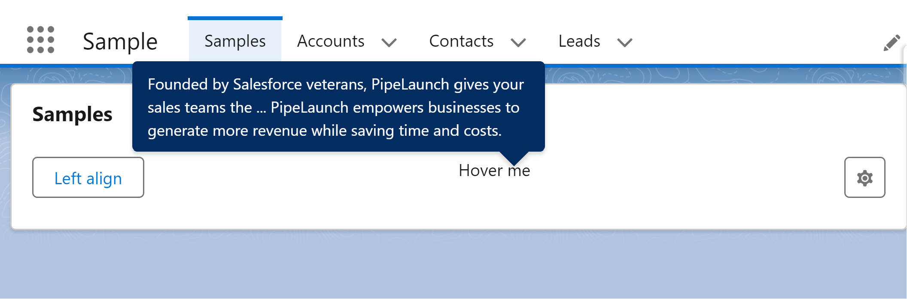

# LWC Tooltip (BETA)



## About

Generic LWC component to wrap a tooltip. Similar to the lightning-helptext component, but with the possibility to wrap any component.

## Features

-   Native SLDS Style
-   Support all the SLDS variants (TODO)
-   Integrated on a single component (easy to copy to multiple projects)
-   Pure CSS (no javascript timeouts or event listeners)

## Instructions

### Use on your project

Everything was developed in a single LWC, so you just need a new single component on your project.

-   Copy the following files to your project:
    -   force-app/main/default/lwc/lwcTooltip/\*\*
-   Call the component and pass the options

```html
<c-lwc-tooltip content="User settings">
    <lightning-button-icon icon-name="utility:settings" alternative-text="Settings" title="Settings"></lightning-button-icon>
</c-lwc-tooltip>
```

### Testing and learn how to use it

-   Run the `createorg.sh` to create a scratch org
-   Open the `Samples` lightning app
-   Explore the code on the `samples` component
-   Edit the page to preview on mobile devices or login with your mobile device (check the `password.env` file)

## References

https://www.lightningdesignsystem.com/components/tooltips/

https://developer.salesforce.com/docs/component-library/bundle/lightning-helptext

https://react.lightningdesignsystem.com/components/tooltips/
